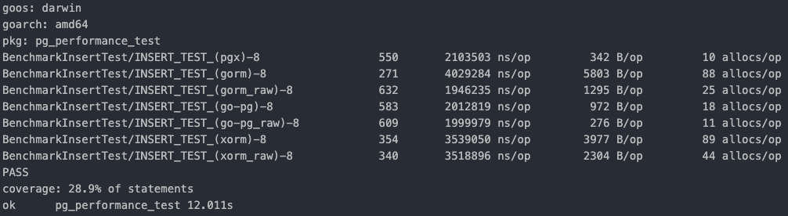

# ORM Performance Testing

- For benchmark performance between PGX, Gorm, Go-pg, Xorm on postgres.

- Gorm, Go-pg and Xorm using both their orm and exec raw sql.

- Benchmark with Insert, Update, Delete method.

## Getting Started

1. Start Postgres docker

```bash
$ ./start-docker.sh
```

2. Initialize database

```bash
$ ./migrate-db.sh
```

\*note if you cannot run script.

```bash
$ chmod 755 start-docker.sh migrate-db.sh
```

## Run Benchmark

- Benchmark Insert

```bash
$ go test -bench=BenchmarkInsertTest
```

- Benchmark Update

```bash
$ go test -bench=BenchmarkUpdateTest
```

- Benchmark Delete

```bash
$ go test -bench=BenchmarkDeleteTest
```

\*note if you want to run all benchmark.

```bash
$ go test -bench=.
```

## Result

- Benchmark Insert



| Engine     | #1 (ns/op,B/op,allocs/op) | #2 (ns/op,B/op,allocs/op) | #3 (ns/op,B/op,allocs/op) | #avg (ns/op,B/op,allocs/op) |
| ---------- | ------------------------- | ------------------------- | ------------------------- | --------------------------- |
| PGX        | 2103503, 342, 10          | 1907730, 335, 10          | 2323930, 326, 10          | 2111721, 334, 10            |
| Gorm       | 4029284, 5803, 88         | 4383680, 5894, 88         | 4870865, 5820, 88         | 4427943, 5839, 88           |
| Gorm(raw)  | 1946235, 1295, 25         | 2090575, 1299, 25         | 2094899, 1311, 25         | 2043903, 1301.67, 25        |
| Go-pg      | 2012819, 972, 18          | 1987296, 971, 18          | 1950745, 971, 18          | 1983620, 97.33, 18          |
| Go-pg(raw) | 1999979, 276, 11          | 2178022, 276, 11          | 1826669, 275, 11          | 2001556.67, 275.67, 11      |
| Xorm       | 3539050, 3977, 89         | 3468434, 3975, 89         | 3440560, 3975, 89         | 3482681.33, 3975.67, 89     |
| Xorm(raw)  | 3518896, 2304, 44         | 3997685, 2305, 44         | 4397684, 2306, 44         | 3971421.67, 2305, 44        |

> Go-pg < Go-pg(raw) < Gorm(raw) < PGX < Xorm < Xorm(raw) < Gorm

- Benchmark Update

| Engine     | #1 (ns/op,B/op,allocs/op) | #2 (ns/op,B/op,allocs/op) | #3 (ns/op,B/op,allocs/op) | #avg (ns/op,B/op,allocs/op) |
| ---------- | ------------------------- | ------------------------- | ------------------------- | --------------------------- |
| PGX        | 2391836, 161, 3           | 2389018, 158, 3           | 2531612, 159, 3           | 2437488.67, 159.33, 3       |
| Gorm       | 6376191, 6255, 71         | 5140264, 6277, 72         | 5064755, 6309, 71         | 5527070, 6280.33, 71.33     |
| Gorm(raw)  | 2401507, 1118, 18         | 2316122, 1118, 18         | 2344330, 1119, 18         | 2353986.33, 1118.33, 18     |
| Go-pg      | 2902843, 952, 20          | 2550883, 952, 20          | 2374476, 952, 20          | 2609400.67, 952, 20         |
| Go-pg(raw) | 2701414, 136, 5           | 2370764, 136, 5           | 2541746, 136, 5           | 2537974.67, 136, 5          |
| Xorm       | 4421454, 2821, 77         | 4490232, 2823, 77         | 4463799, 2821, 77         | 4458495, 2821.67, 77        |
| Xorm(raw)  | 4761293, 2100, 39         | 4373207, 2099, 39         | 4098750, 2099, 39         | 4411083.33, 2099.33, 39     |

> Gorm(raw) < PGX < Go-pg(raw) < Go-pg < Xorm(raw) < Xorm < Gorm

- Benchmark Delete

| Engine     | #1 (ns/op,B/op,allocs/op) | #2 (ns/op,B/op,allocs/op) | #3 (ns/op,B/op,allocs/op) | #avg (ns/op,B/op,allocs/op) |
| ---------- | ------------------------- | ------------------------- | ------------------------- | --------------------------- |
| PGX        | 2229091, 153, 2           | 2337861, 154, 2           | 2535253, 152, 2           | 2367401.67, 153, 2          |
| Gorm       | 6668163, 5518, 61         | 6085883, 5533, 61         | 6196919, 5496, 61         | 6316988.33, 5515.67, 61     |
| Gorm(raw)  | 1924826, 984, 14          | 2672518, 984, 14          | 1968622, 975, 14          | 2188655.33, 981, 14         |
| Go-pg      | 2553691, 888, 15          | 2208570, 888, 15          | 2760307, 888, 15          | 2507522.67, 888, 15         |
| Go-pg(raw) | 2717484, 120, 5           | 2335525, 120, 5           | 2925073, 120, 5           | 2659360.67, 120, 5          |
| Xorm       | 4341518, 2740, 73         | 4655146, 2737, 73         | 4694329, 2737, 73         | 4563664.33, 2738, 73        |
| Xorm(raw)  | 4591012, 1912, 33         | 4158332, 1912, 33         | 3818477, 1912, 33         | 4189273.67, 1912, 33        |

> Gorm(raw) < PGX < Go-pg < Go-pg(raw) < Xorm(raw) < Xorm < Gorm

## Contact

[Thanunya](mailto:b.beemmps@gmail.com)
